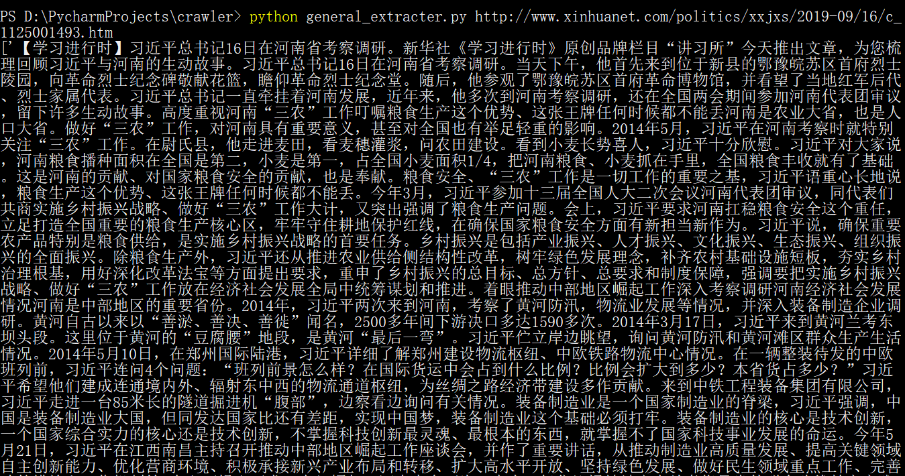

###  [common_crawler.py](common_crawler.py) 
普通的网络爬虫。

简单的get请求，单线程爬取。

###  [crawler_by_multithread.py](crawler_by_multithread.py) 

多线程爬虫。

python中的多线程是虚假的多线程。由于python的GIL(Global Interpreter Lock)机制，同一时间只能运行一条线程，所以对于CPU密集型任务，多线程运行效果不如单线程。但对于爬虫这种I/O密集型任务，多线程的效果还是不错的。

###  [crawler_by_coroutine.py](crawler_by_coroutine.py) 

协程爬虫。

解决python的GIL问题。本质上也是多线程，但只开了一条线程，程序内部自行对线程资源进行调度。

###  [crawler_by_multiprocess.py](crawler_by_multiprocess.py) 

多进程爬虫。

不建议在Windows下使用python的多进程。因为Windows下没有fork机制，是虚假的多进程。

###  [crawler_by_simulate_browser.py](crawler_by_simulate_browser.py)

模拟浏览器爬虫。

真正意义上的万能爬虫方法。但由于要渲染js，故爬虫速度较慢。

### [crawl_media.py](crawl_media.py) 

一些爬取媒体流文件的方法。

### [general_extracter.py](general_extracter.py)

通用文本抽取器。

无需分析页面结构，即可对源html抽取正文内容。

#### 效果展示

网页截图： 

提取结果：

